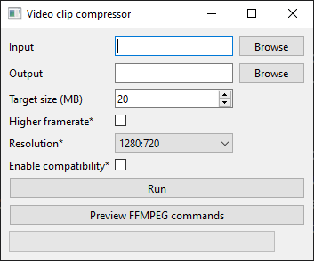

# Video Clip Compressor

[](README.md)
[](README.fr.md)

This program is used to compress short videos to a specific size so they can be sent on *some* platforms.

## Dependencies
- [pymediainfo](https://github.com/sbraz/pymediainfo)
- [FFMPEG](https://ffmpeg.org/) (see [NOTICE](./NOTICE))
- [PySide6](https://wiki.qt.io/Qt_for_Python) (see [NOTICE](./NOTICE))

# Usage
## CLI
| Parameter              | Default    | Possible values                          | Explanation                        |
| ---------------------- | ---------- | ---------------------------------------- | ---------------------------------- |
| `-i` `--input`         |            |                                          | Input video file path              |
| `-o` `--output`        |            |                                          | Output video file path             |
| `-t` `--target`        | `20`       | `0 < Any`                                | Target file size in MB             |
| `-f` `--framerate`     | Not used   |                                          | Use higher framerate               |
| `-r` `--resolution`    | `1280:720` | `Any` (See libx264 and/or libsvtav1 doc) | Set output resolution              |
| `-c` `--compatibility` | Not used   |                                          | Use older codecs (h264, aac)       |
| `-p` `--preview`       | Not used   |                                          | Show work infos without running it |
| `-y` `--overwrite`     | Not used   |                                          | Overwrite output file is it exists |


### Examples
Encode a `input.mov` video to a `output.mkv` video with 720p60 h264 video and aac audio, targeting the default output size.
```bash
$ uv run .\src\cli.py -i input.mov -o output.mkv -f -c
```
---

Encode a `clip.mp4` video to a `clip_compressed.mkv` video with 1080p30 AV1 video and opus audio, targeting 50MB.
```bash
$ uv run .\src\cli.py -i clip.mp4 -o clip_compressed.mkv -r 1920:1080 -t 50
```
---

Preview encode work of a `clip.mp4` video to a `clip_compressed.mkv` video with 540p30 AV1 video and opus audio, targeting 50MB.
```bash
$ uv run .\src\cli.py -i clip.mp4 -o clip_compressed.mkv -r 960:540 -t 50 
==================== Preview =====================
File paths
    Input path           : clip.mp4
    Output path          : clip_compressed.mkv
Video settings
    Resolution           : 960:540
    Duration             : 10 s
    Framerate            : 30 fps
    Target size          : 50 MB
    Enable compatibility : False
FFMPEG Commands
    First pass           : ffmpeg -y -i clip.mp4 -c:v libsvtav1 -preset 6 -svtav1-params rc=2:pred-struct=1:tbr=16220k -passlogfile . -r 30 -vf scale=960:540 -pass 1 -an -f null NUL
    Second pass          : ffmpeg -y -i clip.mp4 -c:v libsvtav1 -preset 6 -svtav1-params rc=2:pred-struct=1:tbr=16220k -passlogfile . -r 30 -vf scale=960:540 -pass 2 clip_compressed.mkv
==================================================
```

### GUI
I'm sure you can figure it out without help..\

